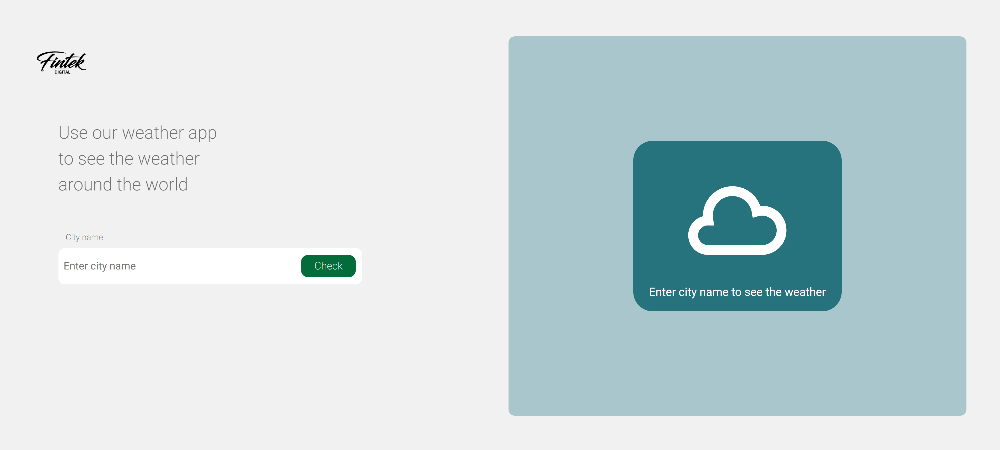
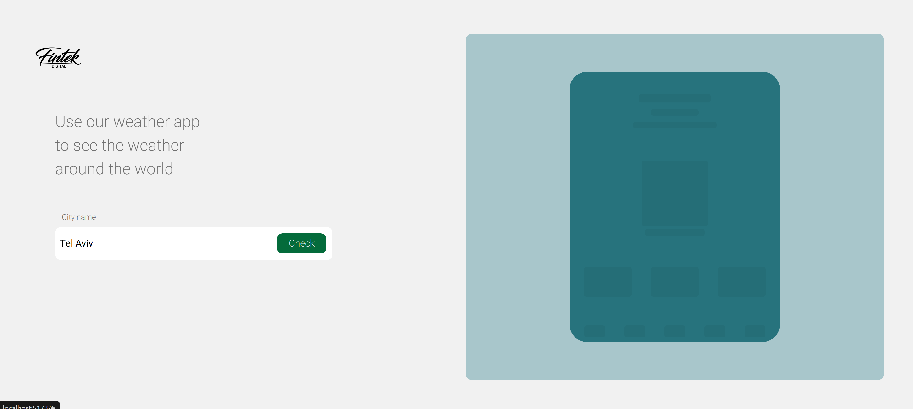
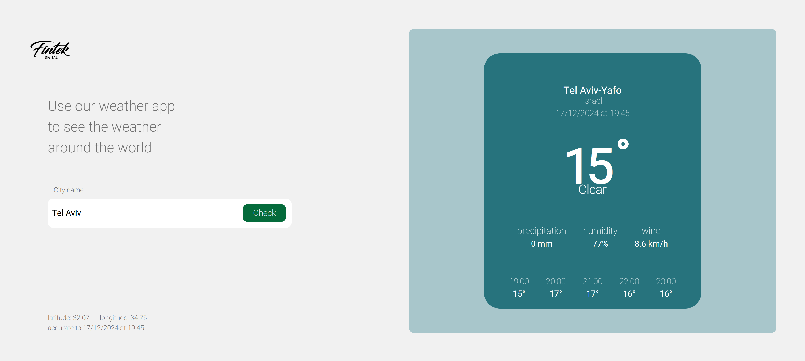
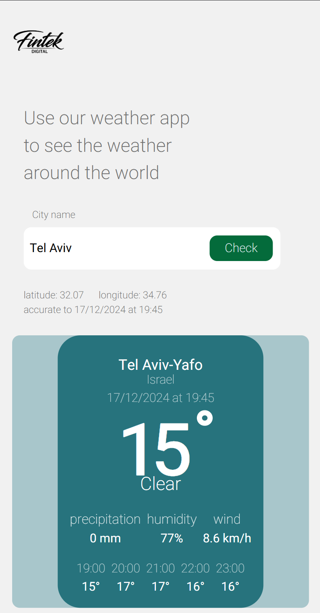

# Weather forecast Site

A simple and responsive weather application that allows users to check the current weather and forecasts for any city around the world. Built with React for the frontend and Node.js for the backend.

## Features
- Search for weather by city name.
- View current weather conditions including temperature, humidity, and wind speed.
- Display hourly forecasts for the next five hours.

## Technologies Used
- **Frontend**: React, CSS
- **Backend**: Node.js, Express
- **API**: [Weather API](https://www.weatherapi.com/)
- **State Management**: Context API
- **Styling**: CSS Modules / Styled Components

## Screenshots

### Desktop View - No Data


### Desktop View - Loading Skeleton


### Desktop View - With Data


### Mobile View


## Installation

1. Clone the repository:
   ```
   git clone https://github.com/Shlomihaser/weather-web-app.git
   cd weather-web-app
   ```

2. Install Backend Dependencies:
   ```
   cd backend
   npm install
   cd ..
   ```

3. Install Frontend Dependencies:
   ```
   cd frontend
   npm install
   cd ..
   ```

4. Set up the `.env` file in the backend folder:
   ```
   cd backend
   touch .env
   ```
   Add the following to the `.env` file:
   ```
   PORT=5000
   WEATHER_API_KEY=your_api_key_here
   WEATHER_API_URL=http://api.weatherapi.com/v1/forecast.json
   ```
   Replace `your_api_key_here` with your actual Weather API key.

5. Start the Backend Server:
   ```
   cd backend
   npm run dev
   ```

6. In a new terminal, start the Frontend React App:
   ```
   cd frontend
   npm run dev
   ```

7. Open your browser and navigate to `http://localhost:5173` to use the application.


## API Reference

### Get Weather Forecast by City

```
GET /api/weather?city=${cityName}
```

| Parameter | Type   | Description                                     |
|-----------|--------|-------------------------------------------------|
| `city`    | string | **Required**. Name of the city to fetch weather data for |

#### Response

```
{
  "success": true,
  "data": {
    "location": {
      "name": "City Name",
      "country": "Country Name",
      "lat": 0.0,
      "lon": 0.0,
      "localtime": "YYYY-MM-DD HH:MM"
    },
    "current": {
      "temp_c": 0.0,
      "condition": {
        "text": "Weather condition"
      },
      "wind_kph": 0.0,
      "precip_mm": 0.0,
      "humidity": 0
    },
    "forecast": {
      "forecastday": [
        {
          "hour": [
            {
              "time": "YYYY-MM-DD HH:MM",
              "temp_c": 0.0
            }
          ]
        }
      ]
    }
  }
}
```


## Troubleshooting

- Ensure you have the latest version of Node.js installed
- Check that your Weather API key is valid and has not expired
- Verify your internet connection
- Make sure all dependencies are correctly installed

## Performance Optimization

- The application uses React's lazy loading and code splitting
- Zustand is used for efficient state management
- Minimal external libraries to keep the bundle size small


## License

This project is open source and available under the [MIT License](LICENSE).

## Contact

Shlomi Haser - hasshlomi21@gmail.com

Project Link: [https://github.com/Shlomihaser/weather-web-app](https://github.com/Shlomihaser/weather-web-app)
